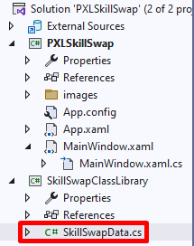
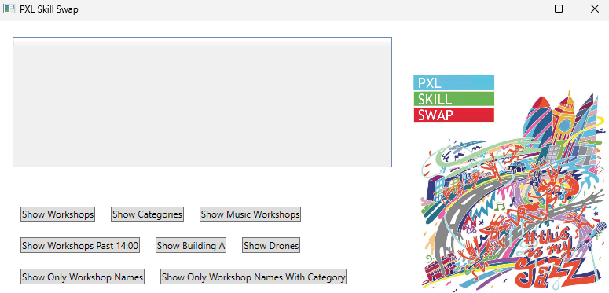

# LINQ-3---PXLSkillSwap

De PXL organiseert een festival waarin de verschillende departementen workshops organiseren waaraan studenten kunnen deelnemen. In deze workshops worden de “skills” van de verschillende departementen “geswapt”.

In deze oefening ga je een **DataSet** gebruiken (disconnected datamodel) om vragen te beantwoorden over het festival **Skill Swap**.

Gebruik het skelet van het project **PXL Skill Swap** om je antwoorden in te laden in het DataGrid. In de `SkillSwapClassLibrary` vind je een klasse `SkillSwapData` met een statische methode:

```
public static void GetSkillSwapDataSet()
```

Deze classe geeft een `DataSet festivalDataset` en beide `DataTable`'s.



Gebruik de methode `.AsEnumerable()` op de gewenste `DataTable` om LINQ-queries te bouwen op de verzameling rijen.

Maak anonieme objecten om je resultaten mooier te formuleren. 

**Bijvoorbeeld:**
```
var queryWorkshopNames = dtWorkshops.AsEnumerable().Select(x => new { Name = x["WorkshopName"] });
```

---

## LINQ Queries (met ADO.NET)



Elke vraag is gelinkt aan een `Button` in `MainWindow`. Beantwoord de volgende vragen door middel van LINQ op de `festivalDataset`:
1. Toon alle namen van de workshops uit de `festivalDataset` in het DataGrid.
2. Toon alle id's en namen van de categorieën uit de `festivalDataset` in het DataGrid.
3. Toon alle informatie van de workshops van de categorie `"Music"`.
4. Toon alle workshops die na 14u00 worden georganiseerd.
5. Toon alle workshops die plaatsvinden in gebouw A.
6. Toon alle workshops die een sessie omtrent `"drones"` doen.
7. Toon een lijst van workshops met enkel de workshopnamen (geen andere kolommen zichtbaar).
8. Toon alle workshops in het formaat: `workshopnaam - categorie`.
